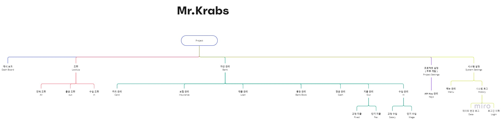

# Mr-Krabs
내 재테크를 위한 개발

## 사용 한 것

- [Jira](https://applan.atlassian.net/jira/software/projects/MK/boards/1/roadmap)
- [Github](https://github.com/applan/Mr-Krabs-api)

| SoftWare     |   Use    | Version |
|--------------|:--------:|:-------:|
| `Language`   |   Java   |   11    |
| `FrameWork`  |  Spring  |  2.6.4  |
| `Build Tool` |  Gradle  |  7.4.1  |
| `DB`         | MariaDB  |  10.x   |
| `IDE`        | IntelliJ |         |
| `Project`    |   Jira   |         |
| `Version`    |  GitHub  |         |

## 요구사항 마인드 맵
> 2022-04-05에 정리

## 프로젝트 구조
- kr
  - co
    - mrkrabs
      - core
        - domain
          - bank      [은행]
            - controller
            - entity
            - repository
            - service
          - bankbook  [통장]
            - controller
            - entity
            - repository
            - service
          - card      [카드]
            - ...
          - category  [사용처 카테고리]
            - ...
          - fixedcost [고정 지출]
            - ...
          - savings   [적금]
            - ...
          - cash      [현금]
            - ...
      - global
        - config
        - model

## 참고한 사이트

- JPA
  - [\[JPA\]\[GenerationType\] 기본키(PK) 매핑 방법 및 생성 전략](https://gmlwjd9405.github.io/2019/08/12/primary-key-mapping.html)
  - [\[JPA\]\[Mapping\] 다양한 연관관계 매핑 - @OneToMany @ManyToOne @OneToOne @ManyToOne](https://jyami.tistory.com/21) 
